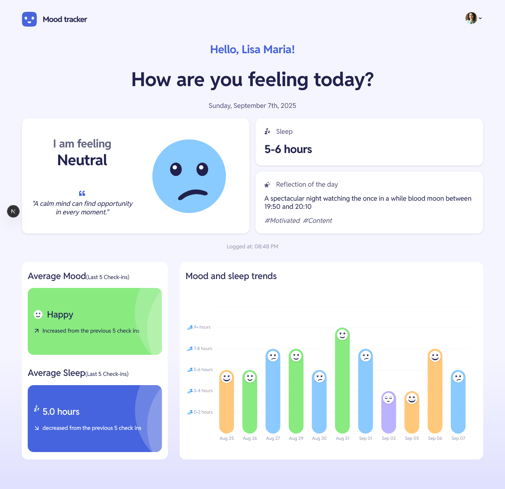

# Frontend Mentor - MoodTracker - Personal Mood & Sleep Analytics

This is a solution to the [Mood tracking app challenge on Frontend Mentor](https://www.frontendmentor.io/challenges/mood-tracking-app-E2XeKhDF0B). Frontend Mentor challenges help you improve your coding skills by building realistic projects.

## Table of contents

- [Overview](#overview)
  - [Logo](#logo)
  - [Features](#features)
      [Screenshot](#screenshot)
    - [Core Functionality](#-core-functionality)
    - [Authentication & Security](#-authentication--security)
    - [Data Visualization](#-data-visualization)
    - [User Experience](#-user-experience)
  - [Tech Stack](#️-tech-stack)
    - [Frontend](#frontend)
    - [Backend and Database](#backend--database)
    - [Form Handling](#form-handling)
    - [File Storage & Communication](#file-storage--communication)
    - [Development & Deployment](#development--deployment)
      - [Vercel (Recommended)](#vercel-recommended)
      - [Manual Deployment](#manual-deployment)
  - [Getting Started](#-getting-started)
    - [Prerequisites](#prerequisites)
    - [Installation](#installation)
  - [Configuration](#-configuration)
    - [Database Schema](#database-schema)
    - [Authentication](#authentication)
    - [Email Templates](#email-templates)
  - [Contributing](#-contributing)
  - [License](#-license)
  - [Acknowledgments](#-acknowledgments)
  - [Support](#-support)  
- [Author](#author)

## Overview

A modern, full-stack web application for tracking daily mood patterns and sleep quality with comprehensive analytics and insights. Built with Next.js 14, TypeScript, and a robust authentication system. Data is saved on Neon database

## Logo

### Features

#### Screenshot

#### 🎯 Core Functionality

- **Daily Mood Tracking** - Log your mood with intuitive 5-point scale (-2 to +2)
- **Sleep Pattern Monitoring** - Track sleep hours with detailed analytics
- **Feelings & Emotions** - Tag your entries with specific feelings and emotions
- **Journal Entries** - Write reflective journal entries with your mood logs
- **Interactive Charts** - Visualize your mood and sleep patterns over time
- **Average Calculations** - Compare latest 5 days vs previous 5 days trends
- **Visual Feedback**: Mood icons and color-coded interface

#### 🔐 Authentication & Security

- **NextAuth.js Integration** - Secure authentication with credentials provider
- **Password Reset Flow** - Email-based password recovery system using Resend and React-email
- **Server-Side Validation** - Comprehensive form validation with Zod schemas
- **Protected Routes** - Middleware-based route protection
- **Secure Password Hashing** - bcryptjs for password security

#### 📊 Data Visualization

- **Responsive Charts** - Built with Recharts for mood and sleep visualization. **[Recharts](https://recharts.org/)** - Composable charting library
- **Custom Tooltips** - Detailed hover information with mood icons and data
- **Trend Analysis** - Visual comparison of mood patterns over time
- **Mobile-Optimized** - Fully responsive design for all devices

#### 🎨 User Experience

- **Modern UI** - Built with Radix UI components and Tailwind CSS
- **Dark/Light Theme** - System-aware theme switching
- **Accessibility First** - WCAG compliant with proper ARIA attributes
- **Progressive Enhancement** - Works without JavaScript for core functionality

### 🛠️ Tech Stack

#### Frontend

- **[Next.js 14](https://nextjs.org/)** - React framework with App Router
- **[React 19](https://react.dev/)** - Latest React with concurrent features
- **[TypeScript 5](https://www.typescriptlang.org/)** - Type-safe development
- **[Tailwind CSS 4](https://tailwindcss.com/)** - Utility-first CSS framework
- **[Radix UI](https://www.radix-ui.com/)** - Headless UI component library
- **[Lucide React](https://lucide.dev/)** - Beautiful icon library
- **[date-fns](https://date-fns.org/)** - Modern date utility library

#### Backend & Database

- **[Neon Database](https://neon.tech/)** - Serverless PostgreSQL database
- **[NextAuth.js](https://next-auth.js.org/)** - Authentication for Next.js
- **[Zod](https://zod.dev/)** - TypeScript-first schema validation
- **[bcryptjs](https://github.com/dcodeIO/bcrypt.js)** - Password hashing

#### Form Handling

- **[React Hook Form](https://react-hook-form.com/)** - Performant forms
- **[Headless UI](https://headlessui.com/)** - Unstyled, accessible components

#### File Storage & Communication

- **[EdgeStore](https://edgestore.dev/)** - File upload and storage
- **[Resend](https://resend.com/)** - Email API for transactional emails

#### Development & Deployment

- **[Vercel](https://vercel.com/)** - Deployment and hosting
- **[Vercel Analytics](https://vercel.com/analytics)** - Performance monitoring
- **[PostCSS](https://postcss.org/)** - CSS transformation

### 🚀 Getting Started

#### Prerequisites

- Node.js 18+
- npm or yarn
- PostgreSQL database (Neon recommended)

#### Installation

1. **Clone the repository**
   \`\`\`bash
   git clone <https://github.com/yourusername/mood-tracker.git>
   cd mood-tracker
   \`\`\`

2. **Install dependencies**
   \`\`\`bash
   npm install
   \`\`\`

3. **Set up environment variables**
   \`\`\`bash
   cp .env.example .env.local
   \`\`\`

   Configure the following variables:
   \`\`\`env

   - Database

   DATABASE_URL="your-neon-database-url"

   - NextAuth

   NEXTAUTH_SECRET="your-nextauth-secret"
   NEXTAUTH_URL="<http://localhost:3000>"

   - Email (Resend)

   RESEND_API_KEY="your-resend-api-key"

   - File Storage (EdgeStore)

   EDGE_STORE_ACCESS_KEY="your-edgestore-access-key"
   EDGE_STORE_SECRET_KEY="your-edgestore-secret-key"

   - App Configuration

   APP_URL="<http://localhost:3000>"
   \`\`\`

4. **Set up the database**
   \`\`\`bash

   - Run database migrations (if applicable)

   npm run db:migrate
   \`\`\`

5. **Start the development server**
   \`\`\`bash
   npm run dev
   \`\`\`

6. **Open your browser**
   Navigate to [http://localhost:3000](http://localhost:3000)

#### Vercel (Recommended)

1. Connect your GitHub repository to Vercel
2. Configure environment variables in Vercel dashboard
3. Deploy automatically on push to main branch

#### Manual Deployment

\`\`\`bash
npm run build
npm start
\`\`\`

### 📁 Project Structure

\`\`\`
├── app/                    # Next.js App Router
│   ├── (auth)/            # Authentication routes
│   │   ├── login/         # Login page
│   │   ├── signup/        # Registration page
│   │   └── forgot-password/ # Password reset
│   ├── dashboard/         # Main dashboard
│   ├── api/              # API routes
│   └── globals.css       # Global styles
├── components/           # React components
│   ├── ui/              # Reusable UI components
│   └── ...              # Feature-specific components
├── lib/                 # Utility libraries
│   ├── auth.ts          # Authentication utilities
│   ├── db.ts            # Database connection
│   ├── types.ts         # TypeScript definitions
│   └── utils.ts         # Helper functions
├── actions/             # Server actions
├── hooks/               # Custom React hooks
├── public/              # Static assets
└── scripts/             # Database scripts
\`\`\`

### 🔧 Configuration

#### Database Schema

The application uses PostgreSQL with the following main tables:

- `users` - User accounts and profiles
- `mood_entries` - Daily mood and sleep logs
- `password_reset_tokens` - Password reset functionality

#### Authentication

NextAuth.js is configured with:

- Credentials provider for email/password login
- JWT strategy for session management
- Custom pages for login/signup/forgot-password

### Email Templates

Transactional emails are sent via Resend for:

- Password reset requests
- Account verification (if enabled)

## 🤝 Contributing

1. Fork the repository
2. Create a feature branch (`git checkout -b feature/amazing-feature`)
3. Commit your changes (`git commit -m 'Add amazing feature'`)
4. Push to the branch (`git push origin feature/amazing-feature`)
5. Open a Pull Request

### 📝 License

This project is licensed under the MIT License - see the [LICENSE](LICENSE) file for details.

### 🙏 Acknowledgments

- [Radix UI](https://www.radix-ui.com/) for accessible component primitives
- [Tailwind CSS](https://tailwindcss.com/) for utility-first styling
- [Recharts](https://recharts.org/) for beautiful data visualization
- [NextAuth.js](https://next-auth.js.org/) for authentication
- [Vercel](https://vercel.com/) for seamless deployment

### 📞 Support

If you have any questions or need help, please:

- Open an issue on GitHub
- Check the [documentation](docs/)
- Contact the maintainers

### Author

---
